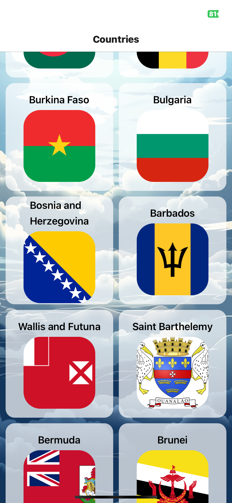
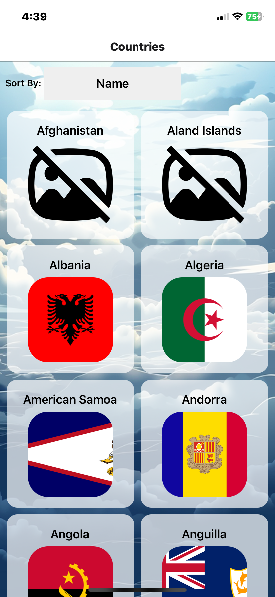
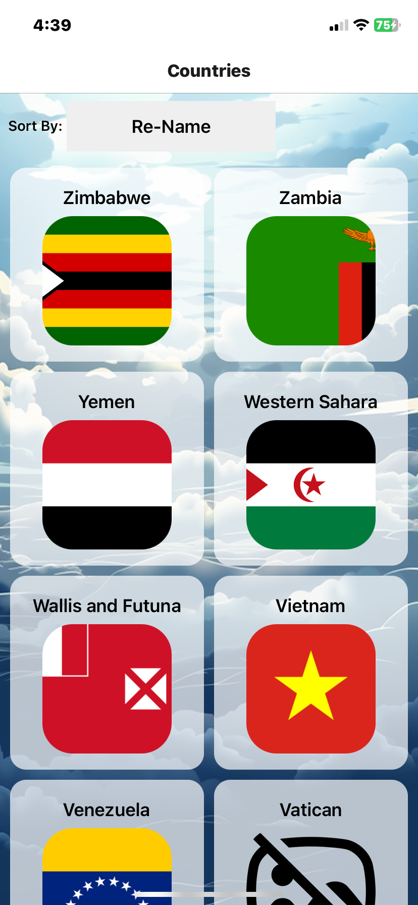

# Country App

## 1. Introduction

CountryApp is a simple mobile application that supports web, Android, and iOS devices. The app is developed using Expo tools and React Native.

### Backend Data Source
The app utilizes an external API (https://sampleapis.com/api-list/countries) as the backend data source to fetch basic information about countries.

## 2. Features

Display basic information of 250 countries, including:
Country name
Country code
Capital
Dialing code
Population
Currency name
Flag
Emblem
Location

## 3. Screens
### Default Display

### Sorted alphabetically by country name

### Sort by country name in reverse order

### Sort by country population

### Sort by country population in reverse order
