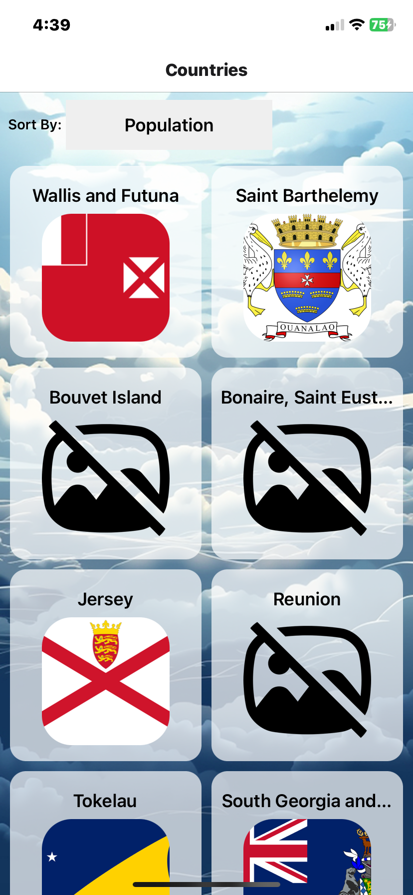

# Country App

## 1. Introduction

CountryApp is a simple mobile application that supports web, Android, and iOS devices. The app is developed using Expo tools and React Native.

### Backend Data Source

The app utilizes an external API (https://sampleapis.com/api-list/countries) as the backend data source to fetch basic information about countries.

## 2. Features

Display basic information of 250 countries, including:

<ul>
    <li>Country name</li>
    <li>Country code</li>
    <li>Capital</li>
    <li>Dialing code</li>
    <li>Population</li>
    <li>Currency name</li>
    <li>Flag</li>
    <li>Emblem</li>
    <li>Location</li>
</ul>

## 3. Screens

### Default Display / Sorted alphabetically by country name / Sort by country name in reverse order

    
    
    

### Sort by country population / Sort by country population in reverse order

    
    

### Details of a country page by clicking

    
    
    

